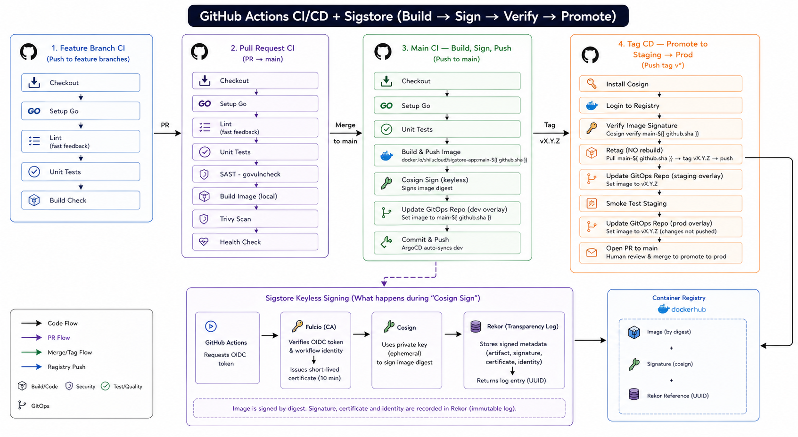

# sigstore-app



A minimal Go HTTP server demonstrating a secure software delivery pipeline using Sigstore (Cosign + Fulcio + Rekor) and GitOps with ArgoCD.

---

## Application

Two endpoints:

| Endpoint  | Description                              |
|-----------|------------------------------------------|
| `GET /health` | Returns status, version, and environment |
| `GET /hello`  | Returns a greeting from the current env  |

---

## Repository Structure

```
sigstore-app/
├── main.go                          # Go HTTP server
├── go.mod
├── Dockerfile                       # multi-stage build, scratch final image
└── .github/
    └── workflows/
        ├── feature.yaml             # lint + unit tests on feature branch push
        ├── pr.yaml                  # full tests + local docker build on PR to main
        ├── main.yaml                # build + cosign sign + push on main push
        └── release.yaml             # verify + retag + promote on tag push
```

---

## CI Pipeline

Four workflows, each triggered at a different point in the development lifecycle.

### `feature.yaml`  fast feedback

Triggered on every push to any branch except main.

- `golangci-lint` —> lint
- `go test ./...` —> unit tests
- `go build ./...` —> compile check

No image is produced. No registry is touched. Goal is feedback under 3 minutes.

### `pr.yaml`  half CI

Triggered on pull requests targeting main.

- Lint + unit tests
- `govulncheck` —> known Go vulnerability scan
- `docker build` with `push: false` verifies the Dockerfile is healthy
- Hits `/health` endpoint on the locally built image to confirm it starts

Nothing reaches Docker Hub. The image is built and discarded.

### `main.yaml`  build, sign, push

Triggered on every push to main.

- Runs full tests again on a clean build
- Builds and pushes image to Docker Hub tagged as `main-<sha>`
- Signs the image digest with Cosign (keyless no long-lived keys)
- Updates `apps/overlays/dev/kustomization.yaml` in the gitops repo
- ArgoCD auto-syncs dev

The image is tagged with the full commit SHA, never `latest`. Mutable tags defeat the point of content-addressable signing.

### `release.yaml`  promote to staging → prod

Triggered on tag pushes matching `v*`.

- Resolves the image built for this commit (`main-<sha>`)
- Verifies the Cosign signature  confirms it was signed by this repo's CI
- Retags as `v<semver>`  **no rebuild**
- Updates `apps/overlays/staging/kustomization.yaml` in the gitops repo
- ArgoCD auto-syncs staging
- Runs smoke tests against staging
- Opens a PR to update `apps/overlays/prod/kustomization.yaml`
- A human merges the PR → ArgoCD detects drift → manual sync approval in ArgoCD UI

---

## How to Release

```bash
# 1. merge your PR to main
# 2. wait for main.yaml to go green (image built and signed)
# 3. tag the commit
git tag v1.0.0
git push origin v1.0.0
# 4. release.yaml triggers automatically
# 5. review and merge the prod promotion PR in sigstore-gitops
# 6. approve sync in ArgoCD UI
```

Never tag before the main CI green check. The release workflow expects the image to already exist in Docker Hub.

---

## Signing

Images are signed using Cosign in keyless mode. There are no long-lived signing keys to manage.

At build time, GitHub Actions presents an OIDC token to Fulcio (Sigstore's CA). Fulcio issues a short-lived certificate (10 minutes) binding the ephemeral signing key to this repository's CI identity. The signing event is permanently recorded in Rekor (Sigstore's transparency log).

To verify an image locally:

```bash
cosign verify \
  --certificate-identity-regexp="https://github.com/shilucloud/sigstore-app/.github/workflows/.*" \
  --certificate-oidc-issuer="https://token.actions.githubusercontent.com" \
  docker.io/shilucloud/sigstore-app:main-<sha>
```

---

## Required Secrets

| Secret                | Purpose                                   |
|-----------------------|-------------------------------------------|
| `DOCKERHUB_USERNAME`  | Push images to Docker Hub                 |
| `DOCKERHUB_TOKEN`     | Docker Hub access token                   |
| `GITOPS_PAT`          | GitHub PAT with write access to sigstore-gitops |

---

## Related

- GitOps repo: [github.com/shilucloud/sigstore-gitops](https://github.com/shilucloud/sigstore-gitops)
- Docker Hub: [hub.docker.com/r/shilucloud/sigstore-app](https://hub.docker.com/r/shilucloud/sigstore-app)